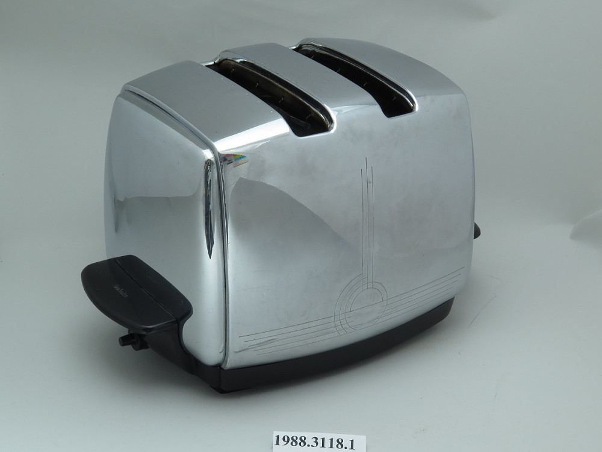
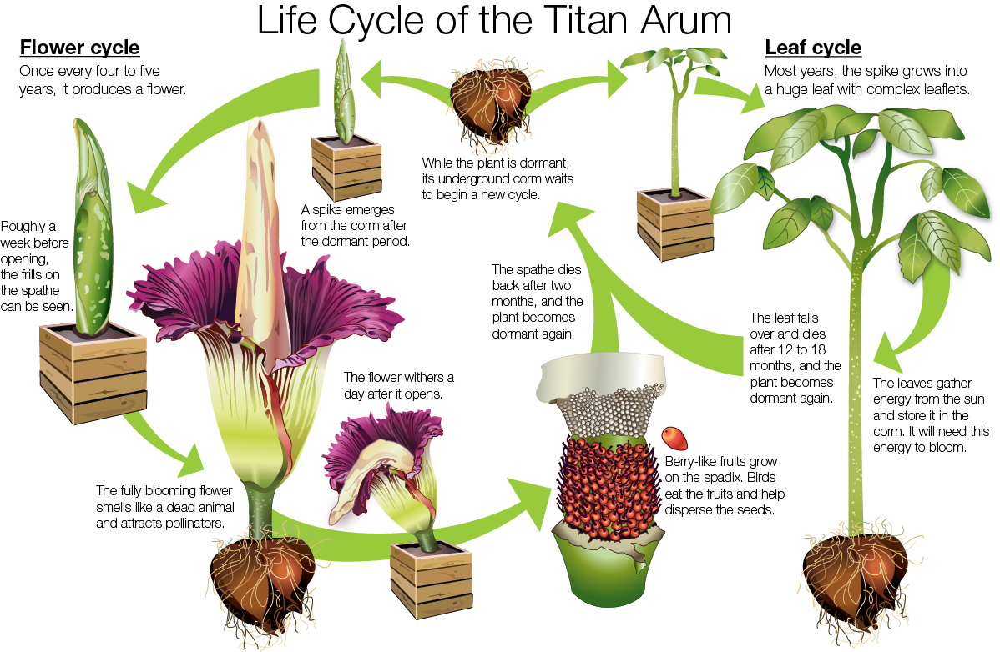
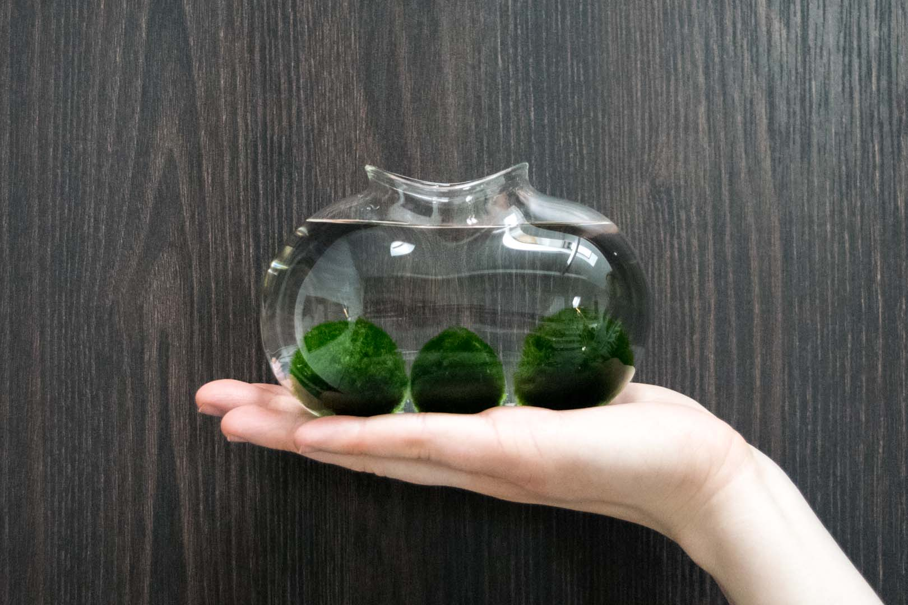
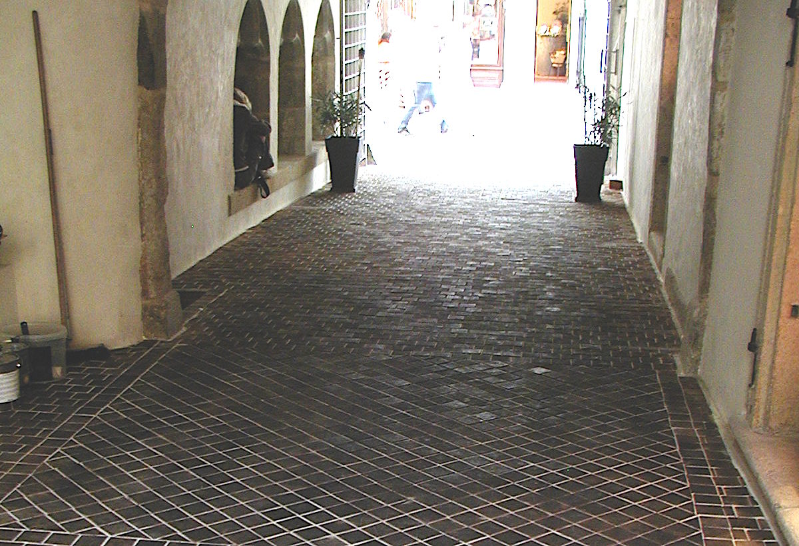

# Home
A list of stuff I'd like to have in my home some day.

## SunBeam automatic toaster
Magic toaster from the sixties that lowers and pops the bread automatically. The timing is 'radiant controlled' wich means the thermostat probes the temprature (and therefore darkness) of the bread itself. And the design is a lick!
- [in action](https://www.youtube.com/watch?v=1OfxlSG6q5Y)
- [fan site](http://automaticbeyondbelief.org/)

## Flora
The more plants the better. Plants listed here are somewhat interesting.

### Amorphophallus
Most of the time this plant is not visible at all. All you'll get is just a box of clay. However during the spring you start to water it and then in few weeks a giant stem will grow straight up only to dry out and 'die' month or two later.

### Marimo
Cute little ball of green stuff calmly floating in clear water. You can squish or cuddle it when you feel lonely.

## Nicolson pavement
Supposing I need to pave some that kind of space somewhere between outside and inside, wooden blocks just give the nice atmosphere. They look good, feel great to walk on and sound great.

